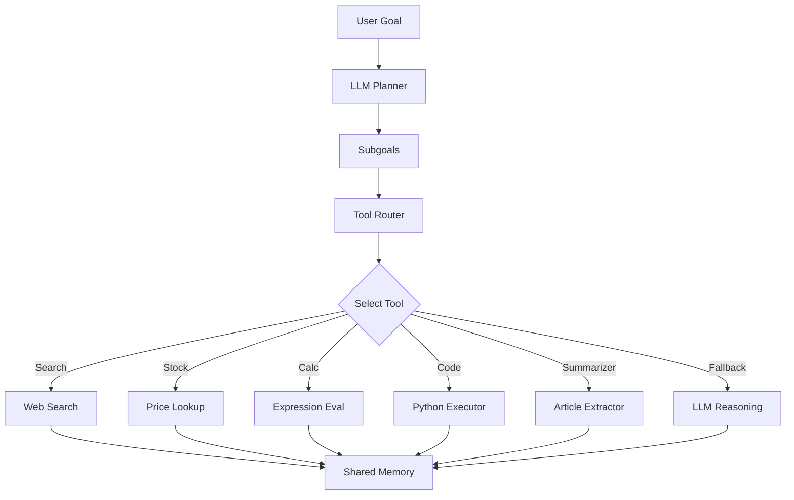

# 🧠 LLM Multi-Tool Agent

[](https://github.com/)
[](https://www.python.org/)
[](https://llm-multitool-agent.streamlit.app/)
[](https://www.langchain.com/)
[](LICENSE)

---

### 🔍 Overview

This project implements a **goal-driven AI assistant** capable of breaking down natural language goals into actionable steps — selecting and executing the appropriate tools autonomously.

Originally built for an **AI Engineering internship assessment**, this agent demonstrates prompt engineering, tool orchestration, and reasoning via modular LangChain workflows.

🔗 **Live Demo:** [llm-multitool-agent.streamlit.app](https://llm-multitool-agent.streamlit.app/)

---

### 🧠 What It Can Do

Some real queries this agent has handled:

* ⚡ `"Find async Python best practices, implement an async web scraper, and benchmark it"`
* 📊 `"Create a Python program that analyzes the word frequency in a given text"`
* 🧠 `"Search for information about machine learning and summarize a relevant article"`
* 💻 `"Write Python code to find prime numbers up to 50 and execute it"`
* ➕ `"132+345"`, `"cosine 30 degree"`, `"8 cubed"`, `"999 + 1"`
* * 📈 `"Find the current stock price of Apple"`

---

### 🎯 Key Features

* 🧩 **Subgoal Decomposition** — Breaks user instructions into logical steps using LLMs
* 🔧 **Tool Routing** — Dynamically selects tools (calculator, search, code executor, summarizer)
* 💬 **Memory-Preserving Agent Loop** — Maintains state and passes intermediate results
* 🌐 **Web Integration** — Stock data (`yfinance`), search (DuckDuckGo), and article summarization
* 👩‍💻 **Code Execution** — Secure Python execution for logic, math, and scripts
* 💡 **LLM Reasoning** — Falls back to GPT when tool context isn’t available
* 🧪 **Tested Queries** — Wide variety of math, code, and real-world info retrieval tested

---

### 🛠️ Tech Stack

| Component         | Tool / Library                                |
| ----------------- | --------------------------------------------- |
| LLM Controller    | OpenAI API via LangChain                      |
| Frontend UI       | Streamlit                                     |
| Math & Code Tools | Built-in Python runtime                       |
| Web Data          | DuckDuckGo, `yfinance`, `newspaper3k`         |
| Tool Management   | Custom routing & planning modules             |
| Hosting           | [Streamlit Cloud](https://streamlit.io/cloud) |

---

### ⚙️ Architecture



---

### ▶️ Run Locally

```bash
git clone https://github.com/ritunjaym/llm-multitool-agent
cd llm-multitool-agent
pip install -r requirements.txt
export OPENAI_API_KEY=your-key-here
streamlit run demo/app.py
```

---

### 📁 Directory Structure

```
llm-multitool-agent/
│
├── demo/              # Streamlit UI
├── agent/             # Subgoal planner & tool router
├── tools/             # Individual tools (search, calc, code, etc.)
├── prompts/           # Prompt templates
├── logs/              # Memory & session logs
├── evaluation/        # Benchmarking (optional)
```

---

### 💡 Why It Matters

This project reflects:

* 🔍 Strong grasp of **LLM tool integration and reasoning**
* 🧱 Ability to build modular, production-ready AI systems
* 📈 Comfort working across frontend (Streamlit), backend (Python), and LLM APIs

It showcases **end-to-end ownership**, **tool-building**, and **real-world prompt engineering** — highly relevant for applied AI engineering roles.

---

### 📄 License

MIT License
